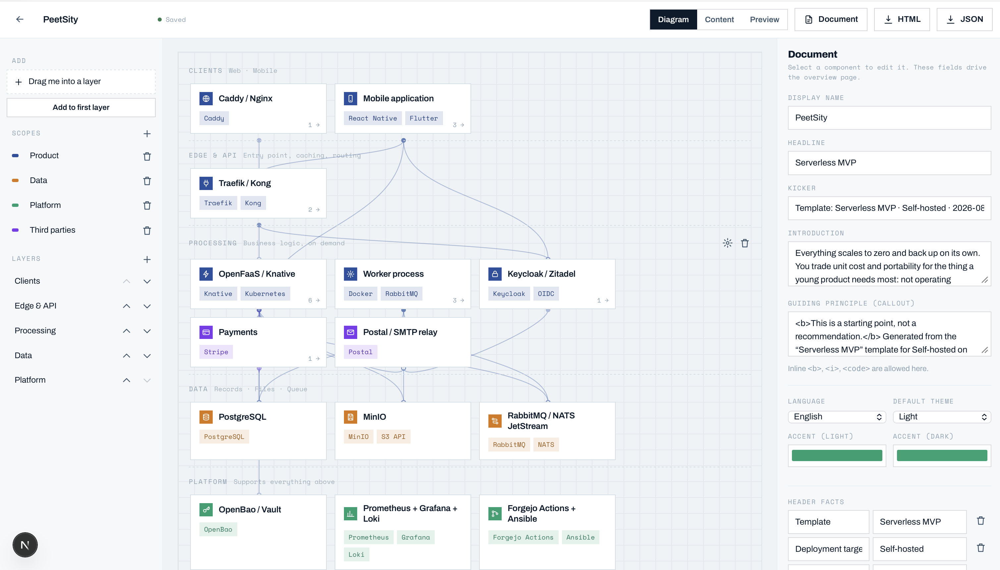
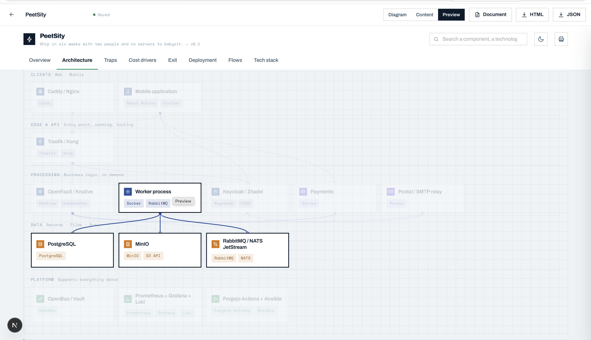
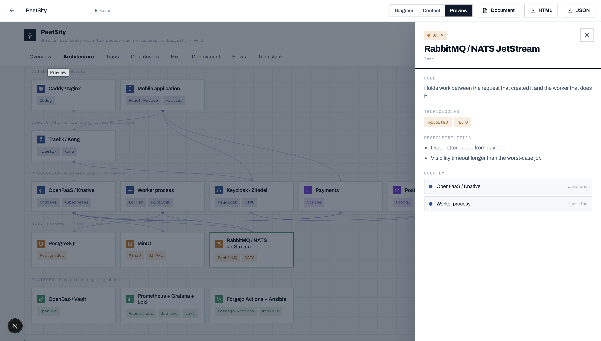

# ArchStudio

**Draw the architecture once. Send the document.**

A self-hosted studio for architecture documentation. Organise many architectures in folders,
build each one by dragging components onto layers, and export a self-contained HTML file anyone
can open.

```bash
npm install
npm run dev          # http://localhost:3000
```

That is the whole setup. No database server, no accounts, no cloud. A SQLite file appears at
`data/studio.db` on first run, seeded with one example architecture in an *Examples* folder so
the editor has something to open. Delete the folder and it is gone for good.

---

## Screenshots

The editor — layers as rows, scopes in the left rail, and the inspector editing whatever is
selected. Here it holds the document's own fields: name, headline, introduction, principle,
language, theme.



The **Preview** tab renders the exported file itself, in an iframe. Hovering a component dims
everything it does not touch, so a dependency reads at a glance — here, the worker and the three
data stores it writes to.



Clicking one opens its panel: role, technologies, responsibilities, and who depends on it in
which direction. The same panel ships inside the exported HTML.



---

## What it does

**Workspace** — every architecture is a project. Projects live in nested folders you create;
drag a project card onto a folder in the sidebar to move it. Search across all of them.

**Editor** — the canvas is your architecture. Layers are rows; drag components between them, drag
a component onto another to reorder, drag the dot under a card onto another card to create a
dependency. The inspector on the right edits whatever is selected — name, scope, layer, icon,
technologies, role, responsibilities, dependencies. Nothing has a Save button: edits persist
700 ms after you stop typing.

**Dependencies say how, not just who.** Open a dependency in the inspector and it takes a
protocol, a note, and one of three kinds — synchronous, asynchronous, batch. The kind is drawn
rather than written: a solid line waits for its answer, a dashed one is queued, a dotted one is
scheduled. It is the *stroke* and not the colour because colour already means scope, and a dash
survives a monochrome print. All of it is optional, and an edge nobody has annotated draws
exactly as it always did.

**History** — every save older than five minutes since the last one writes a snapshot. The
**History** button lists them and, for each, what changed *since* it: components added and
removed, renames, moves between layers, edges gained and lost, sections and chapters. Name a
version (“sent to the client”) and it is kept for good — the 30-snapshot cap only ever prunes
automatic ones. Restoring writes a *Before restore* snapshot first, so a restore is itself
undoable.

**Preview** — the preview tab is not a re-implementation. It renders, in an iframe, byte-for-byte
the file you get when you click Export. One renderer, no drift between what you see and what you
ship.

**Export** — a single self-contained HTML file (235–240 KB, no external requests) you can email,
attach to a ticket, commit, or host anywhere. "No external requests" includes the typefaces:
Archivo and Space Mono are inlined as base64, which is most of that weight and the reason the
file looks like the studio on a machine that has never heard of either. Also exports raw JSON,
and an `architecture.js` data file for the standalone viewer.

**Document** — the same architecture as a numbered, printable design document. Print it from the
browser to get a PDF.

**Import** — accepts JSON or a `window.ARCHITECTURE = {…}` data file. Paste it or pick the file.

---

## Templates

“New project” opens two steps: pick a starting point, then name it and aim it at a deployment
target. Six templates ship with the app, in English and French:

| Template | Components | What it answers |
|---|---|---|
| Serverless MVP | 15 | “We launch in six weeks, we are two, we do not want servers” |
| Multi-tenant B2B SaaS | 18 | “Several customer companies on one platform, isolated” |
| RAG — questions over documents | 17 | “Answer questions about our own corpus” |
| Event-driven processing | 16 | “Streams, queues, decoupling, replay” |
| Modular monolith | 14 | “One deployable application, well partitioned inside” |
| Multi-service architecture | 19 | “Several teams, several services, each with its own data” |

Each one carries components, dependencies, flows and three to four written sections — the
comparison of tenancy isolation models, the delivery-guarantee table, the “when to leave
serverless” thresholds. That editorial content is the point; the boxes are the easy part.

**Six templates, not thirty.** A template describes an *abstract* architecture, and every
component carries a per-target correspondence table. The target — vendor-neutral, AWS, Google
Cloud, Azure or self-hosted — is resolved once, at creation:

```
Template (abstract)          Target           Generated document
───────────────────          ──────           ──────────────────
"Message queue"        +     AWS        →     Amazon SQS
                             GCP        →     Cloud Pub/Sub
                             Azure      →     Azure Service Bus
                             self-hosted →    RabbitMQ / NATS JetStream
                             neutral    →     Message queue
```

The `id` never changes, so dependencies stay valid. Resolution filters components a target has no
equivalent for, rewires dependencies straight through the gap (and says so, on the component that
lost a hop), drops flow steps that no longer point anywhere, and generates a *Deployment* tab
listing the whole mapping.

A component whose identity is its business domain — “Service — orders”, “Module — billing” —
keeps its name and takes only the technologies from the target. Five service cards all reading
“ECS Fargate” would be a worse diagram than five cards saying what they do.

**A template is a starting point, not a recommendation**, and the app says so three times: in the
creation dialog, in each template's *Not this one when* list (shown before you choose), and in
`meta.principle` at the top of the generated document, where it is impossible to miss.

**The document has no link back to the template.** No inheritance, no “update from template”
that could overwrite someone's work. Adding a cloud means adding a column to
`src/lib/templates/services.ts`, not writing six more templates.

```
src/lib/templates/
  types.ts              the template contract, and the {en,fr} string helper
  services.ts           the cross-target service table — the file to re-read when a vendor renames something
  index.ts              registry + instantiate()
  serverless-mvp.ts  saas-multitenant.ts  rag.ts
  event-driven.ts    monolith.ts          multi-service.ts
  templates.test.ts     6 templates × 5 targets × 2 languages = 60 documents
  __snapshots__/        one digest per template, to catch silent drift
```

Service names were verified on 2026-08-14 and the date is in `services.ts`. They move — Cloud
Functions became Cloud Run functions, Azure AI Foundry became Microsoft Foundry, Azure AD B2C is
closing in favour of Entra External ID. Re-read that file once a year.

```bash
npm test                        # the 60 instantiations and their invariants
UPDATE_SNAPSHOTS=1 npm test     # accept a deliberate change
```

---

## The identity

*Atelier* — an engineer's tool drawn like a workshop instrument, on the TonuxCorp colours.
Marine ink on white paper, one teal for action, monospace for everything the machine knows.
Square corners, hairline rules, no gradients, no shadows.

**The mark is a node and its dependency** — the smallest sentence the product can say. The filled
disc is the service that calls; the open circle is the one that answers. It is not decoration:
every edge the app draws, on the canvas, in the exported viewer and on the printed page, ends in
those same two shapes. That is how direction reads without an arrowhead, and it is the only thing
still carrying direction once hover is gone.

Five rules hold the whole thing together, and each one is written where it is enforced:

1. **A scope colour never touches a border.** It lives on the icon chip and the technology pills.
   Borders stay neutral — five scopes in a row would otherwise be five frames shouting.
2. **Teal is reserved for what you can act on.** Primary actions, selection, the focused field,
   links, the principle callout. No scope uses teal, or selection would be ambiguous.
3. **Monospace says only what the machine knows.** Technologies, paths, ids, chapter numbers,
   counts, timestamps. Prose is Archivo, on screen and on paper alike.
4. **Circles mean "a node in a graph"** — the mark, an edge endpoint, a flow step. Everything else
   is square, including the scope swatches.
   **The stroke between them says how the call travels** — solid waits, dashed is queued, dotted
   is scheduled. The endpoints never change: direction must not get quieter because a call is
   asynchronous. The table is `src/lib/links.ts`, mirrored by hand in `viewer/engine.js`, which
   ships inside the export and cannot import it.
5. **Paper does not copy hover, focus, or shadow.** `--shadow` stays a token so the printed sheet
   can set it to `none` rather than delete the rules that use it.

| Token | | |
|---|---|---|
| Ink | `#0B1B2B` | text, rules, the mark |
| Paper | `#FFFFFF` | surfaces, cards, the printed page |
| Calque | `#EEF3F6` | the canvas ground, the app background |
| Teal | `#0E7C8A` | the single accent — actions and selection only |
| Cyan | `#00E5FF` | **marine ground only, never on white** |
| Scopes | `oklch(0.62 0.11 h)` | h = 200, 250, 290, 340, 150 |

Cyan is the one colour with a hard rule attached, and the rule is arithmetic: it sits at 1.5:1
against white and 11.3:1 against ink. So it is the inverted mark, the app icon, and the accent the
dark theme uses — teal at that lightness sinks into the navy and stops reading as actionable.
What sits *on top* of a filled chip flips with the theme, which is why it is a token (`--on-fill`)
rather than a literal: white on paper, ink on marine.

```
src/app/globals.css        the token block — the source of truth for the values
src/components/Brand.tsx   the mark's geometry, and the wordmark
viewer/style.css           the same tokens, for the export and the preview
.../document/document.css  the same tokens again, for the printed sheet
public/fonts/              Archivo and Space Mono, self-hosted, six subsets
```

Three stylesheets carry the same block rather than sharing one, because the viewer has to survive
being torn out of the app and mailed as a single file. When you change a value, change it in all
three — `globals.css` is the one to copy from.

**One known trade-off, measured rather than assumed.** Two things work against the scope
palette's separation: lightness is held constant, which is what makes it flat and even, and the
five hues sit on a cool arc rather than the full circle, which leaves 250° and 290° only 40°
apart. Adjacent pairs measure ΔE 7.4 (OKLab×100) for normal vision, falling to 1.4 under
deuteranopia and 1.9 under protanopia — both at 250°/290° — and 2.4 under tritanopia at
200°/250°. Widening the arc or spreading lightness is a different palette rather than a tweak.
Scope is never carried by colour alone in either medium — the diagram labels every card, and the
legend and the inventory table both name the scope in text — so this degrades rather than fails.
The numbers and the knob are in `src/lib/defaults.ts`.

---

## The document format

Each project stores one JSON document — the same shape the viewer consumes. Its core is:

- **groups** — scopes of responsibility, one colour each. Five is the ceiling: the palette is one
  hue circle at fixed lightness and chroma, so a sixth group wraps onto the first hue.
- **layers** — horizontal bands, top to bottom. From four layers up, the last one is treated as
  *support* and drawn without edges, so the infrastructure row does not turn into spaghetti.
- **components** — anything nameable: an app, an API, a database, a bucket, a vendor.
- **deps** — who calls whom. Direction matters: caller → callee.
- **links** — optional, and only ever a *description* of a dependency `deps` already declares:
  `{ to, kind, protocol, note }`. `deps` stays the single source of truth for whether an edge
  exists, so the two cannot disagree — normalisation drops any link whose target is not in
  `deps`, and an edge nobody annotated has no entry at all. That is what keeps a document
  written before this field existed exporting byte-for-byte as it did.

Beyond that the format carries `flows`, `technologies` and editorial `sections`
(`compare`, `cards`, `timeline`, `table`, `text`), all edited from the **Content** tab, plus the
one optional field the printable document reads — `sections[].doc.chapter`. See
`src/lib/types.ts` for the full contract.

---

## The design document

The viewer is tabbed and interactive; a design document is linear and numbered. The **Document**
button in the editor opens `/projects/:id/document` — the same JSON, rendered for paper, with a
cover, a table of contents, numbered chapters, and the diagram as a figure. Print it and choose
“Save as PDF”. **No dependency to install, and no headless browser on the server**: the one
prerequisite is a browser that can print, which is the browser you already opened it in.

The plan follows the Architecture Design Document structure:

```
1  Introduction                     meta.intro, header facts, the principle callout
2  Application architecture         the diagram, then the component inventory, then your chapters
3  Organisation architecture        your chapters
4  DevOps & delivery                your chapters
5  Cost estimation                  your chapters
6  Appendices                       unslotted sections, flows, the technology table
```

A section says where it belongs through one optional field, `doc.chapter` — `"2.4"` — edited in
the Sections panel. **The slot decides order, not the printed number**: numbering is recomputed
from the final position, so deleting a chapter renumbers the rest and an empty part disappears
instead of leaving a hole. A section with no slot lands in the appendices, and nothing else in
the document format changes — the viewer ignores the field entirely.

**The ADD preset.** The Sections panel offers to add the thirteen written chapters an ADD is
expected to carry: scope, data, scalability, tenancy, RPO/RTO, observability, resource
segmentation, IAM, networking, cost management, governance, delivery, cost estimate. They arrive
empty, structured, bilingual and *vendor-neutral* — service names belong to the components, which
already carry their per-target table. Applying it twice adds nothing.

They are also added **off the tab bar**: written for paper, absent from `ui.tabs`, so the
interactive viewer is exactly as it was. Turn one on from the Tabs panel if you want it on
screen too.

**One design, two media.** The print stylesheet is `viewer/style.css` transposed, not a second
look: same tokens, same card, same icon chip, same technology pills, same pole, same phase, same
note — the document's own `theme.brand` drives the page. A card carries its scope colour the way
the diagram does, on the chip and the pills, and its border stays neutral. Anything in
`document/document.css` that reads as a new visual idea is a bug. Two things are deliberately not
copied: hover and focus states, which paper does not have, and the shadow, which becomes a token
set to `none` when printing rather than a rule that disappears.

**The diagram is the hard part.** Edges are geometry measured after layout, and print layout is
not screen layout — measuring at `beforeprint` returns screen coordinates, which is the wrong
number by definition. So the diagram is laid out on a fixed 1000 px stage and scaled by a
transform, on screen and on paper alike: uniform scaling leaves the measured coordinates valid.
On paper the scale fits the page width, or the page height when the diagram is tall enough to
run off the bottom.

Two things a print stylesheet cannot do for you. Keep **background graphics on** in the print
dialog or the scope colours vanish; and the ADD's other diagrams — resource hierarchy, network
topology, CI/CD pipeline — have no equivalent in the document format, so those chapters are
prose and tables today.

If you want the PDF produced by the server rather than by a person, any headless Chrome will
render this route as it stands:

```bash
chrome --headless --no-pdf-header-footer \
  --print-to-pdf=architecture.pdf http://localhost:3000/projects/<id>/document
```

---

## Architecture of the app itself

```
src/app/                  Next.js 15 App Router
  page.tsx                workspace (server) → components/Workspace
  projects/[id]/page.tsx  editor (server)    → components/Editor
  projects/[id]/document/ the printable design document — plan, renderer, print CSS
  api/                    folders, projects, templates, export, import, revisions
src/components/           Workspace, Editor, Inspector, History, Icon, Brand (the mark)
src/lib/
  db.ts                   node:sqlite connection + schema
  store.ts                every query in the app lives here
  types.ts                the document contract
  defaults.ts             blank document, palette, normalisation
  links.ts                the dependency-kind table — stroke, labels, legend
  diff.ts                 two documents → what changed, in words
  templates/              the six templates and instantiate()
  document/               the ADD outline (plan.ts) and its chapter preset
  exportHtml.ts           document → self-contained HTML
viewer/                   the standalone renderer, verbatim
public/fonts/             Archivo + Space Mono, self-hosted and inlined into exports
data/studio.db            your data
```

**Why the document is a JSON blob instead of normalised tables.** The editor holds the whole
document in memory and writes it atomically. Splitting components, dependencies, flows and
sections across six tables would buy joins we never make, and would make import/export a
migration problem. Folders, ordering and revision history *are* relational, because those are
the things we query and reorder.

**Why `node:sqlite` and not Prisma.** Prisma downloads a ~20 MB query engine at install time and
needs a `generate` step — real friction for a tool whose pitch is "clone and run". `node:sqlite`
ships inside Node 22.5+, so the database layer costs **six production dependencies and no install
step at all**: three `@dnd-kit` packages, `next`, `react`, `react-dom`, and nothing for storage.
(`npm install` still lands 27 packages and does compile-or-fetch native binaries — `sharp` and,
on macOS, `fsevents` — but those are Next's, not the database's.) The cost is hand-written SQL and
an API Node still marks experimental. Every query is in `src/lib/store.ts`; if you outgrow it,
that one file is what you rewrite. **Requires Node ≥ 22.5.**

**Revisions.** Every save older than five minutes since the last snapshot writes one. The cap of
30 per project applies to automatic snapshots only: a named checkpoint is never pruned, and the
*Before restore* snapshots a restore leaves behind keep their own ceiling of five. Snapshots are
ordered `created_at DESC, rowid DESC` — `datetime('now')` has one-second granularity, so naming a
checkpoint during an autosave otherwise leaves two rows in the same second with no defined order.
The full surface is `GET/POST/PATCH/DELETE /api/projects/:id/revisions`, driven by the **History**
button in the editor. What that panel shows is computed by `src/lib/diff.ts`, which turns two
documents into sentences rather than a JSON diff.

---

## Deploying it

It is a normal Next.js app with one caveat: it writes to the filesystem, so it does **not** run
on serverless platforms with a read-only disk (Vercel, Netlify functions). Run it where it can
keep a file:

```bash
npm run build && npm start          # a VPS, a Raspberry Pi, a container with a volume
```

There is no authentication. Put it behind your VPN, a reverse-proxy basic-auth, or a Tailscale
network — do not expose it to the open internet as is. Adding auth means one middleware and a
session check in the API routes; the data model does not need to change.

---

## Roadmap

- Diagram placeholders for the document chapters that have none — network topology, CI/CD pipeline
- Keyboard navigation on the canvas, and undo/redo
- Optional auth for shared installs
- Multi-select and bulk move on the canvas

## License

MIT.
